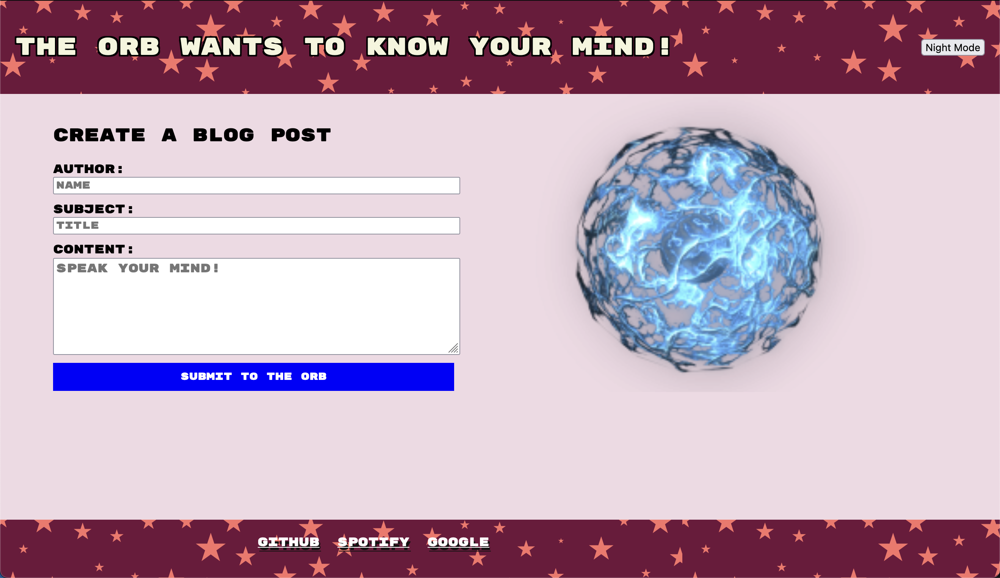
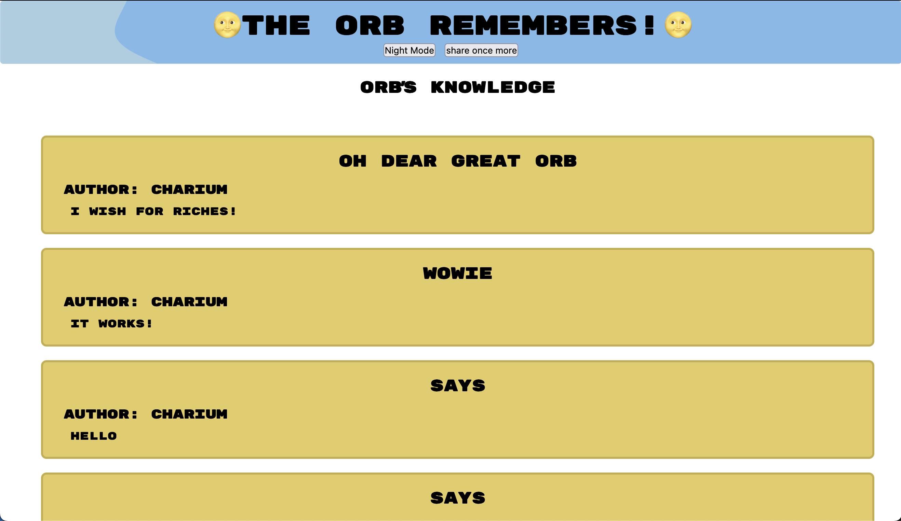

# Peronal Blog
Share all thoughts with the orb, and it will consider you for great fortunes!
## Installation

To install, use git clone https://github.com/charium/PersonalBlog.git to download onto local repo. 

## Usage

Use this page by entering your name, a subject line ("Oh Dear Great Orb" works fine), and all your thoughts into the form. 
To visit the page, go to web address: https://charium.github.io/PersonalBlog/. 

The following page should look like: 

## Credits

This code was downloaded from the UNC-VIRT-FSF-PT-03-2024-U-LOLC source code found on the bootcamp repository. Special thanks to the course instructor, Saia Fonua for guiding me through this lesson. Help was also recieved from the course's AI XPert Learning Assistant, and the course prework module. 

## License

Please refer to the MIT Lisence found in the repo.
